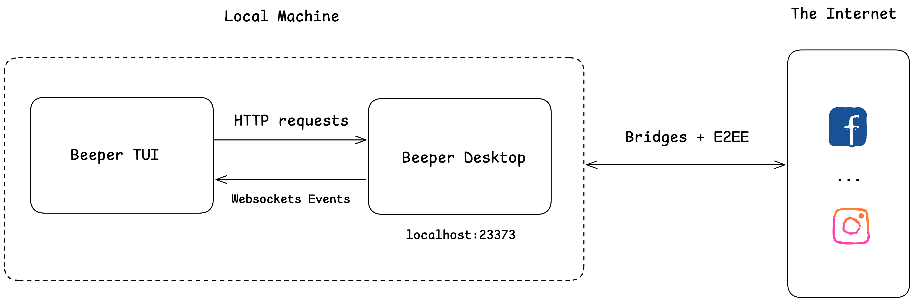

# beeper-tui

A keyboard-driven terminal UI for [Beeper](https://beeper.com), built on top of the local Beeper Desktop API.

You can read and reply to chats across all your networks today. Live updates over WebSocket are in progress.

## How It Works



The TUI talks to a locally-running Beeper Desktop on `localhost:23373`: HTTP requests for actions and queries, WebSocket events for live updates. Beeper Desktop handles the bridges and end-to-end encryption to the actual networks.

## Features

- Tabbed inbox with network logos, unread float-to-top, and a separate section for muted/low-priority chats
- Conversation view with reply support
- Yazi-style preview pane (`p`)
- Archive/unarchive (`a`) and search (`/`)
- Vim-style navigation throughout (`j`/`k`, `gg`/`G`, `Ctrl-u`/`Ctrl-d`)

## Requirements

- Beeper Desktop running locally with the Developer API enabled (Settings → Developers → Beeper Desktop API). Requires Beeper Desktop v4.1.169+.
- Go 1.26 or later.

## Run From Source

During development, prefer `make run`; it always executes the current checkout
instead of an older installed binary.

```bash
make run
```

To refresh the installed `beeper-tui` command:

```bash
make install
```

## Configuration

The TUI auto-discovers your access token from a locally-running Beeper Desktop.

For headless use, set the token explicitly:

```bash
export BEEPER_ACCESS_TOKEN=<token>
```

To override the API base URL (rare):

```bash
export BEEPER_API_BASE_URL=http://localhost:23373
```

## Roadmap

- [x] Read-only triage
- [x] Send/reply
- [ ] Live inbox via WebSocket events
- [ ] Search across chats and messages
- [ ] Attachments, reactions, replies-to-message, threads, edits, deletes

Design specs live in [docs/superpowers/specs](docs/superpowers/specs).

## License

MIT. See [LICENSE](LICENSE).
