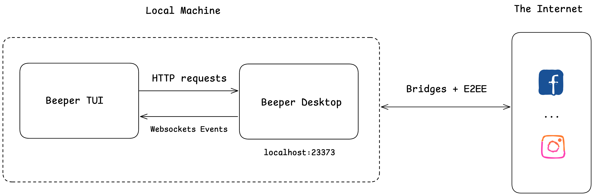

# beeper-tui

A keyboard-driven terminal UI for [Beeper](https://beeper.com), built on top of the local Beeper Desktop API.

You can read and reply to chats across all your networks, with live updates as messages arrive.

## How It Works



The TUI talks to a locally-running Beeper Desktop on `localhost:23373`: HTTP requests for actions and queries, WebSocket events for live updates. Beeper Desktop handles the bridges and end-to-end encryption to the actual networks.

### Live updates

The inbox is driven by WebSocket events from Beeper Desktop. A 30-second REST poll backstops bridges that emit no events.

As of June 2026, iMessage is the only bridge that emits no events, so iMessage chats can lag by up to 30 seconds. Beeper (Matrix), Discord, Facebook Messenger, Instagram, LinkedIn, Signal, WhatsApp, and X all update instantly.

## Features

- Live inbox: WebSocket events with a 30s polling backstop
- Tabbed inbox with network logos, unread float-to-top, and a separate section for muted/low-priority chats
- Conversation view with reply support
- Yazi-style preview pane (`p`)
- Archive/unarchive (`a`) and search (`/`)
- Vim-style navigation throughout (`j`/`k`, `gg`/`G`, `Ctrl-u`/`Ctrl-d`)

## Requirements

- Beeper Desktop running locally with the Developer API enabled (Settings → Developers → Beeper Desktop API). Requires Beeper Desktop v4.1.169+.
- Go 1.26 or later.

## Run From Source

During development, prefer `make run`; it always executes the current checkout
instead of an older installed binary.

```bash
make run
```

## Install (system-wide command)

Install a `beeper-tui` launcher onto your PATH (`~/.local/bin` by default). The
launcher rebuilds from this checkout whenever source is newer than the binary,
so the command does not go stale after you pull or edit:

```bash
make install
```

Then run it from anywhere:

```bash
beeper-tui
```

Optional:

| Target | What it does |
| --- | --- |
| `make install` | Auto-rebuild launcher (recommended for daily use) |
| `make install-bin` | Static copy of the binary only (re-run after changes) |
| `make uninstall` | Remove `~/.local/bin/beeper-tui` |

Override install location with `PREFIX` / `BINDIR` if you want (`PREFIX=~/.local` by default). Set `BEEPER_TUI_VERBOSE=1` to print rebuilds.
## Configuration

The TUI auto-discovers your access token from a locally-running Beeper Desktop.

For headless use, set the token explicitly:

```bash
export BEEPER_ACCESS_TOKEN=<token>
```

To override the API base URL (rare):

```bash
export BEEPER_API_BASE_URL=http://localhost:23373
```

### Assistant model

The chat tab talks to a local model server by default: LM Studio on `localhost:1234`, or Ollama via `BEEPER_LLM_BASE_URL=http://127.0.0.1:11434/v1`.

For stronger answers, switch to [Tinfoil](https://tinfoil.sh) confidential inference:

```bash
export BEEPER_LLM_PROVIDER=tinfoil
export TINFOIL_API_KEY=<key>
```

Prompts then leave the machine only to an attested enclave the client verifies before sending anything, so the operator cannot read them. On both providers, known contact names, handles, phones, and emails are replaced by opaque session tokens before any model call and restored only for display. Enclave verification fetches attestation metadata from GitHub and Sigstore; no message data is involved.

| Variable | Meaning |
| --- | --- |
| `BEEPER_LLM_PROVIDER` | `local` (default) or `tinfoil` |
| `BEEPER_LLM_BASE_URL` | Local server endpoint (default LM Studio's) |
| `BEEPER_LLM_MODEL` | Model id. Autodetected locally; `kimi-k3` on Tinfoil |
| `TINFOIL_API_KEY` | Required by the tinfoil provider |
| `BEEPER_TUI_ALLOW_REMOTE` | `1` allows any other remote endpoint |

## Keybindings

### Chat list

| Key | Action |
| --- | --- |
| `h` / `l` | Switch tab |
| `j` / `k` | Move selection |
| `enter` | Open chat |
| `p` | Toggle preview |
| `a` | Archive / unarchive |
| `/` | Search |
| `q` | Quit |

### Conversation

| Key | Action |
| --- | --- |
| `j` / `k` | Scroll |
| `i` | Reply |
| `r` | React |
| `o` | Open attachment |
| `ctrl+v` | Attach image from clipboard |
| `a` | Archive |
| `q` | Back to list |

### Chat (assistant)

| Key | Action |
| --- | --- |
| `i` / `enter` | Ask |
| `esc` | Stop the response / deselect |
| `n` / `N` | Select next / previous linked name |
| `enter` | Open selected name's conversation |
| `tab` / `shift+tab` | Switch tabs |
| `c` | Clear transcript |

## Roadmap

- [x] Read-only triage
- [x] Send/reply
- [x] Live inbox via WebSocket events
- [ ] Search across chats and messages
- [ ] Attachments, reactions, replies-to-message, threads, edits, deletes
- [ ] Chat tab: assistant over chats and messages
  - [x] Read-only Q&A
  - [x] Identity redaction: session tokens in every model call
  - [x] Tinfoil confidential-inference provider
  - [ ] Send messages

Design specs live in [docs/superpowers/specs](docs/superpowers/specs).

## License

MIT. See [LICENSE](LICENSE).
